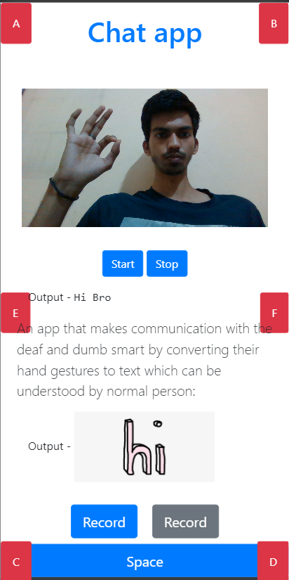

<p align="center"></p>
<h1 align="center">Paired</h1>

> An app that makes communication with the deaf and dumb smart by converting their hand gestures to text which can be understood by normal person.

### Links
- [📹  Presentation Video](https://www.youtube.com/watch?v=0o3-icYknb4)
- [👨🏻‍💼 Presentation File](./Paired.pdf)


### Motive

For actions to speak louder than words, Paired has been designed to enhance the communication between normal and specially abled (deaf and dumb).

- Disabled people face difficulty in
communicating with each other when at
distance.
- Chatting apps currently do not focus on
connecting disabled people.
- Communication using Sign Language
feature is also not enabled in many apps.
-  Communication using the Braille feature also
lacks in many chatting apps.
-  Current messaging apps are also not feasible
for illiterate disabled people.

### Features of Paired

- The app can recognize American Sign
Language from gestures using Machine
Learning enabling Deaf and Dumb to
send messages using it.
-  Incoming messages will be converted
from text to American Sign Language
for the deaf and dumb people to
recognize the messages even if they are
not literate.
-  Blind people can also send messages
using their Braille.
-  The incoming messages will also be
converted to speech to enable blind
people to hear the messages

### Modus Operandi

> 1. The web-based application takes in the data from
the webcam available on the laptop/phone
(machine). This data stream is processed to narrow
down the live data stream.

> 2. The data is now fed into a Cnn based machine
learning model which makes a prediction on the basis
of the symbols present in the video stream made by
the user

> 3. The predictions are displayed and fed to the chat for
the user

> 4. The Process of reading data, preprocessing the video
stream and making predictions on the video is done
for every time the User wants to send a message.

> 5. Blind people will place their fingers over the
button which has been placed at convenient
locations for them.

> 6. They will type the Braille messages which will be
interpreted by the app and then the messages will
be sent to the receiver in both speech and sign
language form


### Technologies

- Django
- Image Processing
- Image classfication using classifier
- Image classification using CNN classifier
- CNN classifier build using Tensorflow

### Testing




### Offline setup and run

move to project root-  paired


1. Create and activate a virtualenv (Python 3)
```bash
python -m venv myenv
cd myenv/Scripts
source activate
cd ../..
```
2. Install requirements
```bash
pip install django
pip install imageio
pip install tensorflow
pip install scikit-image
pip install cv2
pip install numpy
```
3. move to backend
```
move to pairedBackend directory

```
4. Start database Server
```
python manage.py makemigrations
python manage.py migrate

```


5. Create admin user
```bash
./manage.py createsuperuser (not mandatory)
enter name ,email,password ,confirm password,and press y
```

6. Run development server
```bash
./manage.py runserver
```

7. live
http://127.0.0.1:8000/home/

### Team Mates

- Arpit Srivastava
- Aman Raj 
- Aniket Dixit
- Souhard Swami

